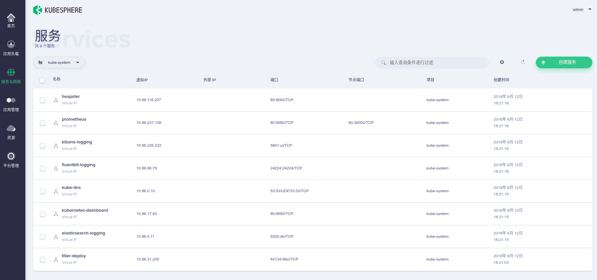
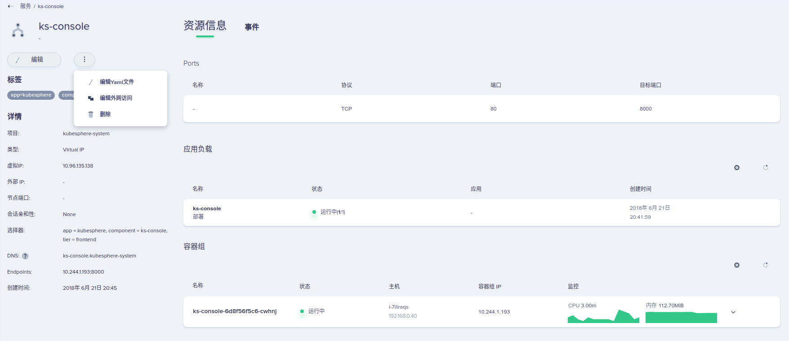

# 服务管理

登录 KubeSphere 控制台，在左侧导航栏选择 **服务与网络** 菜单的 **服务** 进入到服务列表页面。

## 创建服务

1. 填写服务的名称，不能和现有项目下的其它服务名称相同
2. 选择需要创建服务的类型，每种服务类型适合不同的场景。
- VirtualIP: 以集群为服务生成的集群内唯一的IP为基础，集群内部可以通过此IP来访问服务，集群外部可以通过 NodePort 和 LoadBalancer 方式来访问服务。此类型适合绝大多数服务。
- Headless (selector): 集群不为服务生成IP，集群内部通过服务的后端 Pod IP 直接访问服务。此类型适合后端异构的服务，比如需要区分主从的服务。
- Headless (externalname): 将集群或者项目外部服务映射到集群或项目内。
3. 您可以使用选择器来选择不同的后端，使用键值对(Label Selector)可以选择多个部署。填写完成服务的端口号和对应的后端端口号

4. 为即将创建的服务添加标签，让KubeSphere更好的管理资源
5. 为服务选择外网访问方式。LoadBalancer 的方式需要对应的负载均衡器插件来启用，如果未安装插件则无法使用。也可以在服务创建完成后修改外网访问方式。

- None: 只在集群内部访问服务，集群外部无法访问。
- NodePort: 集群外部可以通过访问集群节点的对应端口来访问服务，端口将由集群自动创建。
- LoadBalancer: 通过云服务商提供的负载均衡器来访问服务。

6.创建完成后即可在服务列表中查看到已创建的服务。 

## 服务详情

在服务列表里点击服务即可进入服务详情页面。可以在详情页面查看到服务的具体信息，也可以对服务进行修改编辑操作。譬如修改服务的外网访问方式，删除服务等。

> 在集群中访问服务时，同一项目下可以直接使用服务的 DNS 名称来访问。如上图，在项目 kubepshere-system 下可以直接使用 ks-console:80 来访问服务; 在其它项目下，需要加上项目后缀，使用 ks-console.kubesphere-system 来访问服务。

### 修改外网访问方式

点击左侧 **...** 按钮来编辑服务外网访问方式。

> 修改外网访问方式可能导致其它依赖此服务的应用不可用，请谨慎操作

